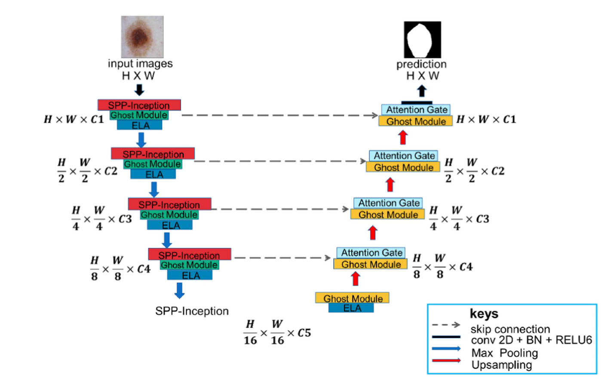

# MSGU-Net: Multi-Scale Ghost U-Net for Medical Image Segmentation

MSGU-Net is a deep learning framework for medical image segmentation, designed to segment anatomical structures in ultrasound images. The architecture combines U-Net with multi-scale feature extraction and Ghost modules, incorporating attention mechanisms and advanced modules for improved segmentation accuracy.

<p align="center">
    
</p>

## Features

- **MSGU-Net Architecture**: Combines U-Net with Multi-Scale, Ghost, and Attention modules.
- **Modular Design**: Easily extensible with custom modules in the `modules/` directory.
- **Dataset Support**: Designed for datasets in `.mha` format (e.g., Pubic Symphysis-Fetal Head Segmentation).
- **Training Pipeline**: Includes scripts and Jupyter notebook for training and experimentation.

## Project Structure

```
MSGU-Net/
├── assets/               # Assets for the GitHub repo
├── model/                # Model architecture (MSGUNet.py)
├── modules/              # Custom modules (Attention, ELA, Ghost, SPP-Inception)
├── train.py              # Training script
├── train.ipynb           # Jupyter notebook for training/experiments
├── requirements.txt      # Python dependencies
├── README.md             # Project documentation
```

## Dataset

The project is designed for medical image segmentation datasets, such as:

- **Pubic Symphysis-Fetal Head Segmentation and Angle of Progression**
	- Images: `Datasets/Pubic Symphysis-Fetal Head Segmentation and Angle of Progression/image_mha/`
	- Labels: `Datasets/Pubic Symphysis-Fetal Head Segmentation and Angle of Progression/label_mha/`

> **Note:** Images and labels should be in `.mha` format. Update paths in your training scripts as needed.

## Installation

1. **Clone the repository:**
	 ```bash
	 git clone <repo-url>
	 cd MSGU-Net
	 ```
2. **Install dependencies:**
	 ```bash
	 pip install -r requirements.txt
	 ```
3. **(Optional) Set up your dataset:**
	 - Place your `.mha` images and labels in the appropriate folders.

## Usage

### Training

- **Using Python script:**
	```bash
	python train.py
	```
- **Using Jupyter Notebook:**
	- Open `train.ipynb` and run the cells for step-by-step training and evaluation.

### Model Architecture

- The main model is defined in `model/MSGUNet.py`.
- The model's modules are in `modules/`:
	- `Attention_Gate.py`
	- `ELA_Module.py`
	- `Ghost_Module.py`
	- `SPP_Inception.py`

## Customization

- Modify or extend modules in `modules/` to experiment with new architectures.
- Adjust training parameters in `train.py` or `train.ipynb` as needed.

## References

- [MSGU-Net: a lightweight multi-scale ghost U-Net for image segmentation](https://www.frontiersin.org/journals/neurorobotics/articles/10.3389/fnbot.2024.1480055/full)
- [U-Net: Convolutional Networks for Biomedical Image Segmentation](https://arxiv.org/abs/1505.04597)
- [GhostNet: More Features from Cheap Operations](https://arxiv.org/abs/1911.11907)
- [Attention U-Net: Learning Where to Look for the Pancreas](https://arxiv.org/abs/1804.03999)
- [Spatial Pyramid Pooling in Deep Convolutional Networks for Visual Recognition](https://arxiv.org/abs/1406.4729)
## License

This project is for academic and research purposes. Please cite relevant papers if you use this code.
