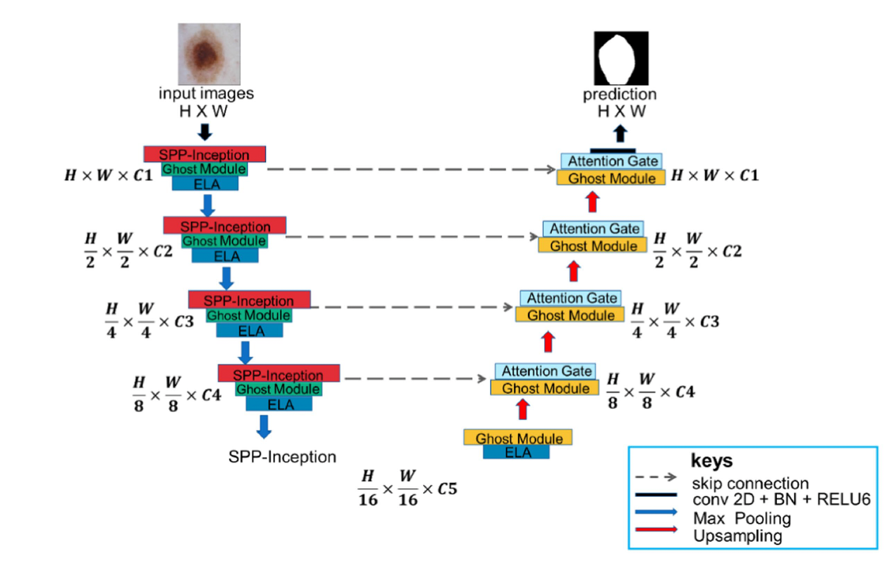

# MSGU-Net: Multi-Scale Ghost U-Net for Medical Image Segmentation

MSGU-Net is a lightweight deep learning framework for medical image segmentation, specifically designed for skin lesion segmentation. The architecture combines U-Net with multi-scale feature extraction, Ghost modules (GhostNetV2), ELA (Efficient Layer Aggregation) modules, SPP-Inception, and Attention Gates for improved segmentation accuracy with reduced parameters.

<p align="center">
    
</p>

## 🎯 Features

- **Lightweight Architecture**: Only ~1.46M parameters with competitive performance
- **MSGU-Net Architecture**: Combines U-Net with Multi-Scale, Ghost, ELA, SPP-Inception, and Attention modules
- **Modular Design**: Easily extensible with custom modules in the `modules/` directory
- **Dataset Support**: ISIC 2017 and ISIC 2018 skin lesion datasets
- **Data Augmentation**: Synchronized image-mask augmentation using Albumentations
- **Training & Evaluation Scripts**: Separate scripts for training and metrics calculation
- **Reproducible**: Seeded random number generation for consistent results

## 📁 Project Structure

```
MSGU-Net/
├── assets/                  # Assets for the GitHub repo
├── model/                   # Model architecture
│   ├── __init__.py
│   └── MSGUNet.py          # Main MSGU-Net model
├── modules/                 # Custom modules
│   ├── __init__.py
│   ├── Attention_Gate.py   # Attention Gate mechanism
│   ├── ELA_Module.py       # Efficient Layer Aggregation
│   ├── Ghost_Module.py     # GhostNetV2 module with DFC attention
│   └── SPP_Inception.py    # Spatial Pyramid Pooling with Inception
├── scripts/                 # Training and evaluation scripts
│   ├── train_isic2017.py   # Training script for ISIC2017
│   ├── train_isic2018.py   # Training script for ISIC2018
│   ├── metrics_isic2017.py # Evaluation script for ISIC2017
│   └── metrics_isic2018.py # Evaluation script for ISIC2018
├── weights/                 # Saved model weights (created automatically)
├── plots/                   # Training curves and predictions (created automatically)
├── requirements.txt         # Python dependencies
└── README.md               # Project documentation
```

## 📊 Dataset

The project supports the following datasets:

### ISIC 2017 & ISIC 2018 Skin Lesion Datasets
- **ISIC 2017**: ~2000 dermoscopic images with lesion segmentation masks
- **ISIC 2018**: ~2594 dermoscopic images with lesion segmentation masks

Dataset structure should be:
```
ISIC2017/
├── train/
│   ├── images/
│   └── masks/
└── val/
    ├── images/
    └── masks/

ISIC2018/
├── train/
│   ├── images/
│   └── masks/
└── val/
    ├── images/
    └── masks/
```

> **Note:** The scripts automatically handle 70:30 train/test split from combined train and val folders.

## 🚀 Installation

1. **Clone the repository:**
   ```bash
   git clone https://github.com/A1maan/MSGU-Net.git
   cd MSGU-Net
   ```

2. **Create a virtual environment (recommended):**
   ```bash
   conda create -n msgunet python=3.10
   conda activate msgunet
   ```

3. **Install dependencies:**
   ```bash
   pip install -r requirements.txt
   ```

## 💻 Usage

### Training

Train the model on ISIC 2017 or ISIC 2018 datasets:

```bash
# Train on ISIC 2017
python scripts/train_isic2017.py

# Train on ISIC 2018
python scripts/train_isic2018.py
```

**Training features:**
- Automatic train/test split (70:30)
- Data augmentation with Albumentations (horizontal/vertical flip, rotation)
- Best model saving based on validation loss
- Learning rate scheduling with ReduceLROnPlateau
- Progress bars with tqdm
- Loss curves visualization

### Evaluation

Evaluate trained models and calculate metrics:

```bash
# Evaluate on ISIC 2017
python scripts/metrics_isic2017.py

# Evaluate on ISIC 2018
python scripts/metrics_isic2018.py
```

**Evaluation metrics:**
- **mIoU** (Mean Intersection over Union)
- **DSC** (Dice Similarity Coefficient)
- **Sensitivity** (Recall/True Positive Rate)
- **Specificity** (True Negative Rate)

All metrics are reported as percentages with 2 decimal places.

## 📈 Results

| Metric | ISIC 2017 | ISIC 2018 |
|--------|-----------|-----------|
| mIoU | 80.76% | 80.49% |
| Dice Score | 88.07% | 87.95% |
| Sensitivity | 87.10% | 88.72% |
| Specificity | 98.31% | 96.79% |

**Model Efficiency:**
- Parameters: ~1.46M
- Competitive performance with lightweight architecture

## 🏗️ Model Architecture

### Core Components

1. **Encoder Path**
   - 4 encoding blocks with increasing channel dimensions
   - Each block: SPP-Inception → GhostModule → ELA Module
   - Max pooling for downsampling

2. **Bottleneck**
   - SPP-Inception → ELA Module → GhostModule
   - Captures multi-scale features at lowest resolution

3. **Decoder Path**
   - 4 decoding blocks with Attention Gates
   - Skip connections from encoder with attention mechanism
   - GhostModule for efficient feature processing

4. **Custom Modules**
   - **SPP-Inception**: Multi-scale feature extraction with parallel pooling
   - **GhostModule**: Efficient feature generation with DFC attention (GhostNetV2)
   - **ELA Module**: Strip pooling for efficient spatial attention
   - **Attention Gate**: Channel and spatial attention for skip connections

## 🔧 Customization

### Modify Training Parameters

Edit the training scripts to adjust:
- Learning rate, batch size, epochs
- Data augmentation strategies
- Loss functions
- Model architecture (base channels, reduction ratios)

### Extend Modules

Add new modules in `modules/` directory:
1. Create your module file (e.g., `MyModule.py`)
2. Add to `modules/__init__.py`
3. Import in `model/MSGUNet.py`
4. Integrate into the architecture

### Change Dataset

Update the `base_dir` paths in training scripts:
```python
base_dir_2017 = "/path/to/your/ISIC2017"
base_dir_2018 = "/path/to/your/ISIC2018"
```

## 📚 References

- [MSGU-Net: a lightweight multi-scale ghost U-Net for image segmentation](https://www.frontiersin.org/journals/neurorobotics/articles/10.3389/fnbot.2024.1480055/full)
- [U-Net: Convolutional Networks for Biomedical Image Segmentation](https://arxiv.org/abs/1505.04597)
- [GhostNetV2: Enhance Cheap Operation with Long-Range Attention](https://arxiv.org/abs/2211.12905)
- [Attention U-Net: Learning Where to Look for the Pancreas](https://arxiv.org/abs/1804.03999)
- [Spatial Pyramid Pooling in Deep Convolutional Networks for Visual Recognition](https://arxiv.org/abs/1406.4729)

## 📄 License

This project is for academic and research purposes. Please cite the relevant papers if you use this code.

## 📧 Contact

For questions or issues, please open an issue on GitHub or contact the repository owner.

---
